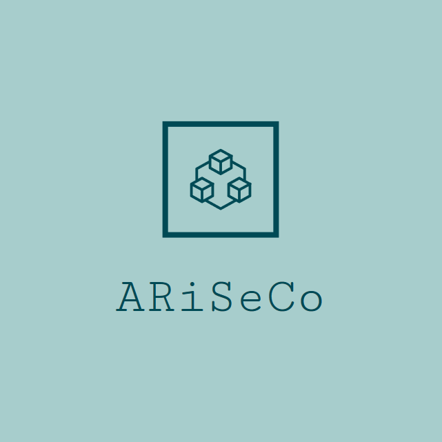
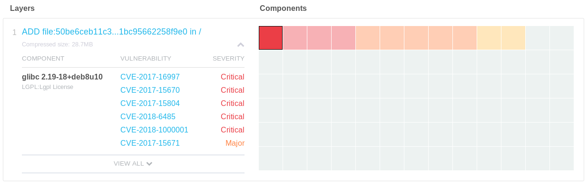
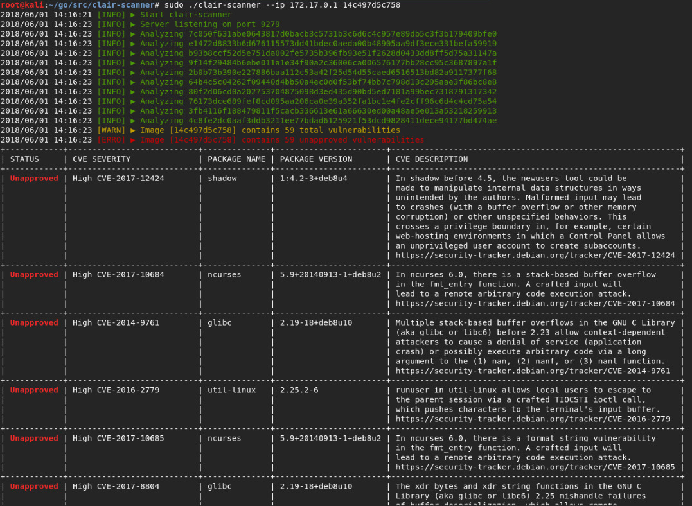
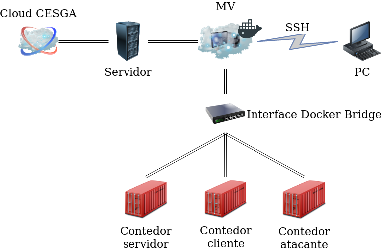
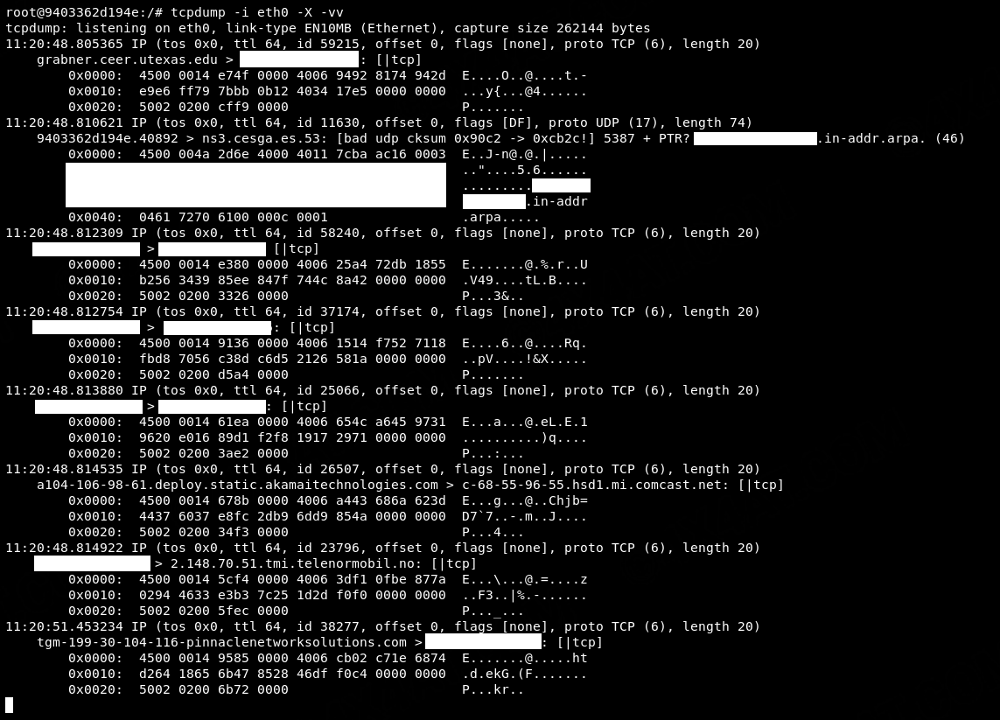
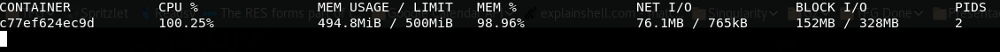
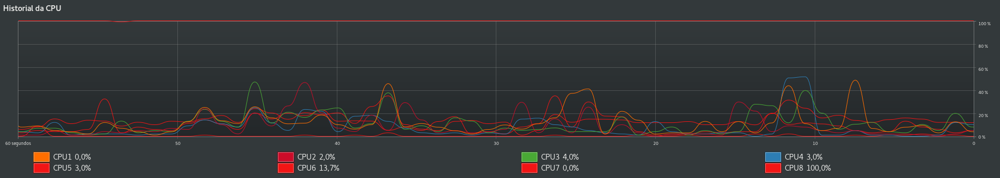

# ARiSeCo

> #riscos #contedores #HPC #docker #singularity #udocker

Traballo de Fin de Grao presentado na Universidade de Santiago de Compostela para o obtención do Grao en Enxeñaría Informática. O presente traballo recolle o estudo realizado no Centro de Supercomputación de Galicia no referente aos riscos de utilizarmos tecnoloxías de contedorización en entornos HPC (_High Performance Computing_).

---

Os obxectivos deste proxecto céntranse en dous puntos:

1. Analizar distintas implantacións de tecnoloxías de contedorización: Docker, Singularity e Udocker, dende o punto de vista das implicacións de seguridade.
2. Determinar os cambios necesarios para poder empregar contedores nun entorno HPC multiusuario de xeito seguro.

---

##  Índice resumido do estudo

- [Tecnoloxías](#tecnoloxías)
- [Detección de vulnerabilidades en imaxes](#Detección-de-vulnerabilidades-en-imaxes)
- [Validación de imaxes](#Validación-de-imaxes)
- [Redes](#Redes)
- [Limitación de recursos](#Limitación-de-recursos)
- [Propostas de mellora](#Propostas-de-mellora)  

---

### Tecnoloxías

Unha introdución ás tecnoloxías de contedorización empregadas ao longo de todo o estudo. Un resumo de aspectos coma o seu funcionamento, seguridade, fluxos de traballo ou limitacións son explicados aquí.

As tecnoloxías de contedorización empregadas son:

- Docker
- Singularity
- Udocker

---

### Detección de vulnerabilidades en imaxes

Neste capítulo teranse en conta os riscos aos que un sistema baseado en  contedores débese afrontar antes incluso de tratar cos mesmos. Debido á  mobilidade que presentan os contedores, debemos estudar antes a  existencia de vulnerabilidades nos mesmos, para non pór en risco o noso  propio sistema.

Para facer o estudo dun xeito práctico, empregaremos as ferramentas _Docker Hub_ (imaxes Docker) e _Clair_ (imaxes Docker e Singularity).

### Validación de imaxes

Continuando co estudo previo, o seguinte paso é asegurar a validación das imaxes, de forma que estas non sexan modificadas por persoas non autorizadas nin sufran cambios indesexábeis.

---

### Redes

Un dos aspectos máis controvertidos á hora de traballar con contedores é  o seu xeito de xestionar as redes. Dependendo da tecnoloxía de  contedorización a empregar esta xestión serán completamente diferente e  suporá a existencia de diferentes riscos.

Realización de probas de _ARP spoofing_, _Man in the middle_ e _MAC flooding_.

### Limitación de recursos

Cando facemos emprega de contedores nun entorno multiusuario debemos ter en conta que existe a posibilidade de que un contedor se apropie de todos  os recursos, deixando aos demais inútiles. Un control dos recursos dos que dispón cada contedor é un punto importante neste tipo de entornos.

---

### Propostas de mellora

Recomendacións para mellorar a seguridade de entornos similares ao tratado ao longo do traballo:

- Contedores correndo sobre máquinas virtuais.
- Aplicación de capas externas de seguridade:
- Modelo centralizado: MAC e SELinux.
- Actualización do sistema.
- Auditoría do sistema.
- Docker Bench Audit Tool
- Listaxe de boas prácticas:
  - Manter só o esencial.
  - Empregar sistemas de só lectura.
  - Limitar as chamadas ao _kernel_.
  - Limitar os recursos.
  - Reducir as vulnerabilidades existentes nas imaxes.
  - Manter actualizadas as tecnoloxías de virtualización.
  - Tratamento adecuada da información confidencial.
  - Non dar acceso a directorios perigosos da máquina anfitrioa.
  - Configurar ferramentas de xestión de OOM.
  - Configurar o _socket_ de Docker de xeito seguro se é precisa unha conexión en rede.
  - Establecer un sistema de detección de vulnerabilidades en imaxes.
  - Empregar mecanismos de validación de imaxes.
  - Empregar mecanismos externos de seguridade.
  - Manter o sistema actualizado.

---

## Licencia

